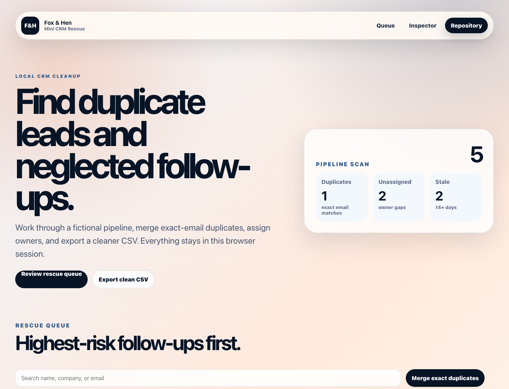

# Mini CRM Rescue

Public Fox & Hen working sample for a **CRM cleanup sprint**.



## Live Demo

- Demo: [https://foxhen-mini-crm-rescue.vercel.app](https://foxhen-mini-crm-rescue.vercel.app)
- Repository: [https://github.com/foxandhenllc/foxhen-mini-crm-rescue](https://github.com/foxandhenllc/foxhen-mini-crm-rescue)

## Purpose

Mini CRM cleanup app for deduping leads, flagging missing fields, prioritizing follow-up, and exporting clean records.

## What This Demo Is

Mini CRM Rescue is a forkable React/Vite operating tool for teams that want to deduplicate leads, expose owner gaps, prioritize follow-up, and package a cleaner pipeline for handoff. It is intentionally small, static, and public-safe so you can copy the pattern without inheriting a backend or vendor lock-in.

## Fully Working Behaviors

- Search, filter, and sort a domain-specific workflow board.
- Add a fictional item and edit owner, notes, priority, value, effort, and friction.
- Advance status and watch readiness metrics update in real time.
- Run a 24-hour sprint simulation to reduce friction on the highest-scoring work.
- Toggle QA gates, generate a handoff report, and download the board as JSON.

## Workflow Template

See [docs/workflow-template.md](docs/workflow-template.md) for the sample pipeline rescue sprint, adaptation checklist, and public-safe data rules.

## Suggested Forks

- Replace sample deals with your fictionalized CRM rows first.
- Score priority by revenue/urgency and friction by missing data.
- Use the inspector to document next step and owner.
- Export a JSON cleanup packet for the next sales ops pass.

## SEO / AIO Discoverability

**Plain-language answer:** Use this repo to model CRM cleanup: deduping leads, flagging missing fields, prioritizing follow-up, and exporting cleaner records.

**Who it helps:** small businesses and sales teams with messy lead lists or lightweight CRMs.

**Search intents covered:**

- CRM cleanup tool
- lead dedupe dashboard
- small business CRM rescue
- sales follow up priority board

**Why this repo is useful:** It demonstrates a practical path from messy contact rows to an actionable sales-ops handoff.

## Local Run

```bash
npm install
npm run dev
npm run build
```

## Public-Safe Scope

This is a static React/Vite demo with fictional sample data. It includes no production data, credentials, real contacts, copied customer work, backend, auth, or external service calls.
